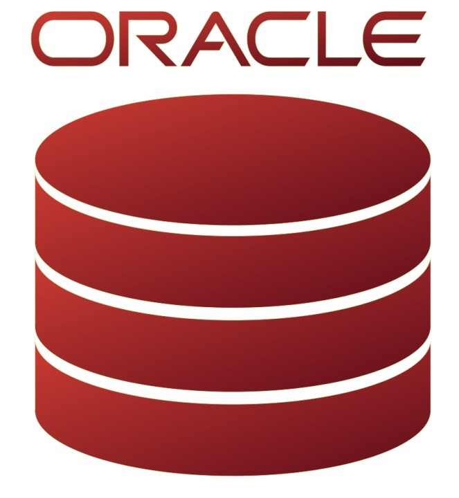
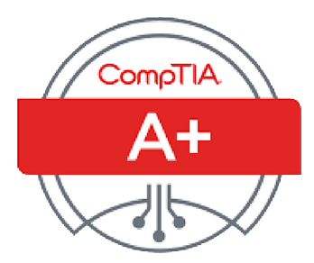

# <h2 align="center">📊 Billie Barcelona 🖥️</h2>

  <b>Hi There!</b> 
   
  I’m a BI Developer with strong background in transforming raw data into meaningful insights and interactive dashboards. 
  I specialize in building end-to-end data solutions from data modeling and ETL development to designing user-friendly reports that support data-driven decisions.

---

<h3>🛠 Skills & Tools</h3>

   Python &nbsp; | &nbsp;&nbsp; SQL &nbsp;| &nbsp;&nbsp; SQL Server &nbsp;| &nbsp;&nbsp; MySQL &nbsp;| &nbsp;&nbsp; OracleDB &nbsp;| &nbsp;&nbsp; Power BI &nbsp;| &nbsp;&nbsp; Microsoft Fabric &nbsp;| &nbsp;&nbsp; Azure Data Lake &nbsp;| &nbsp;&nbsp; Excel &nbsp;| &nbsp;&nbsp;⚙️ETL Development &nbsp;| &nbsp;&nbsp; Git & GitHub

---

<h3>🏆 Certifications</h3>
  <li> <b>DP-600 - Microsof Certified: Fabric Analytics Engineer Associate</b></li>
  <li>  <b>PL-300 - Microsof Certified: Power BI Data Analyst Associate</b></li>
  <li> <b>CompTIA A+</b></li>
  
---

<h3>📂 Featured Projects</h3>
  <li><b>Automated ETL Pipelines</b> – Python & SQL pipelines for data integration.</li>
  <li><b>Data Visualizations</b> – Reports & visual dashboards for analytics insights.</li>
  <li><b>Database Management</b> – Designed and optimized RDBMS (on-prem & cloud) for storing and querying large datasets efficiently.</li>
  <li><b>AI-Powered Insights</b> – Built predictive models and AI analytics dashboards using Python and Power BI to generate actionable insights.</li>
  <li><b>Interactive Data Visualization</b> – Created interactive dashboards and visual reports in Power BI to support data-driven decision-making.</li>
  <li><b>Dashboards</b> – Interactive dashboards using Power BI.</li>

---

  🚀 Feel free to explore my repositories and check out my work!

   

[website]: https://fkcodes.com
[youtube]: https://youtube.com/fknight
